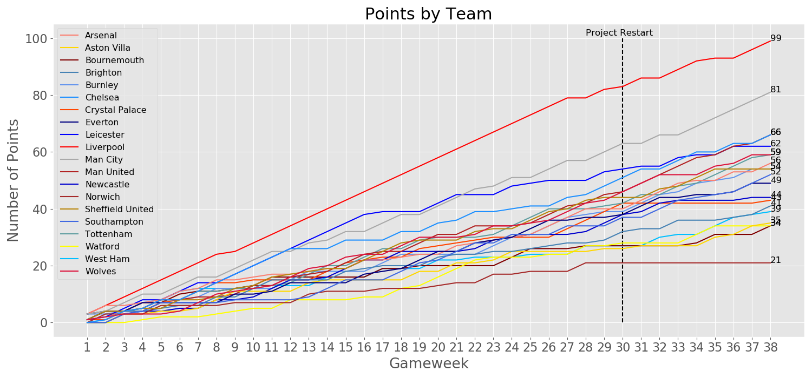
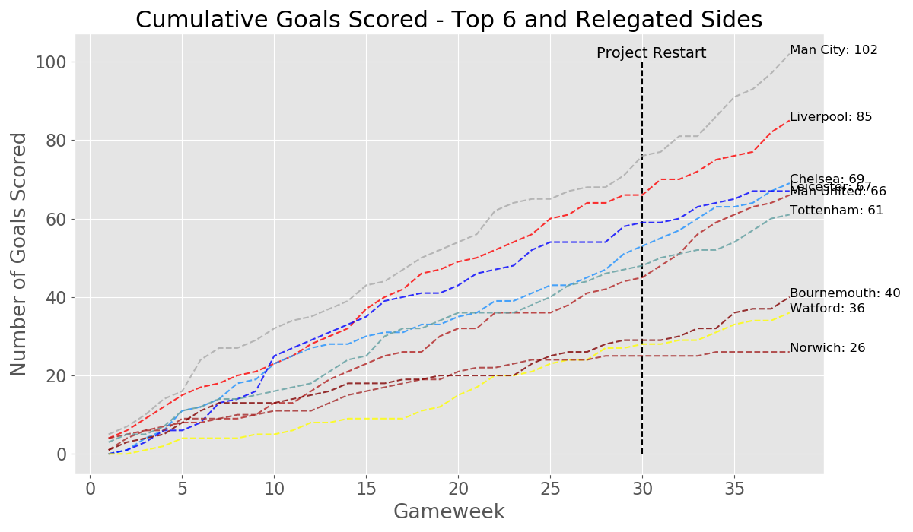
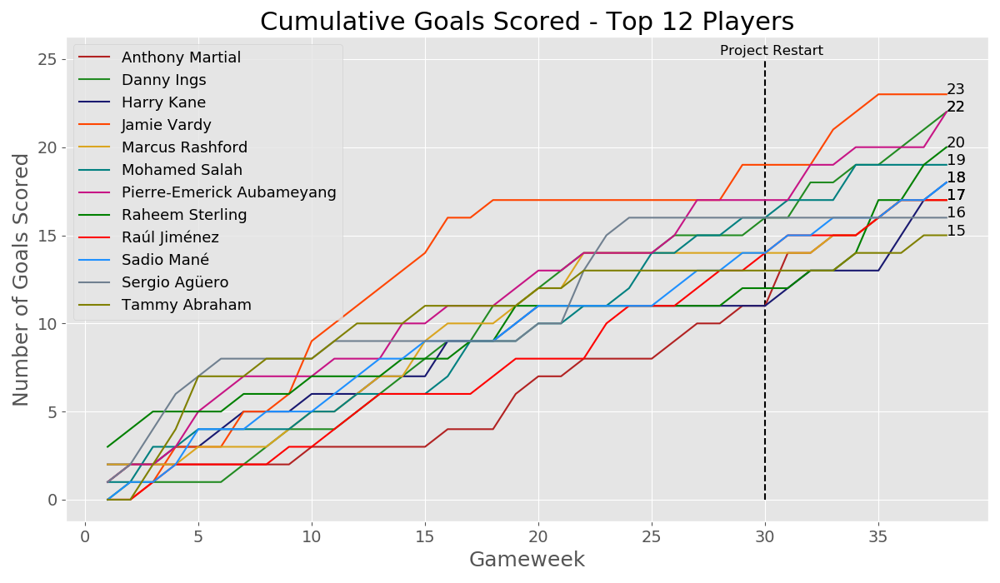
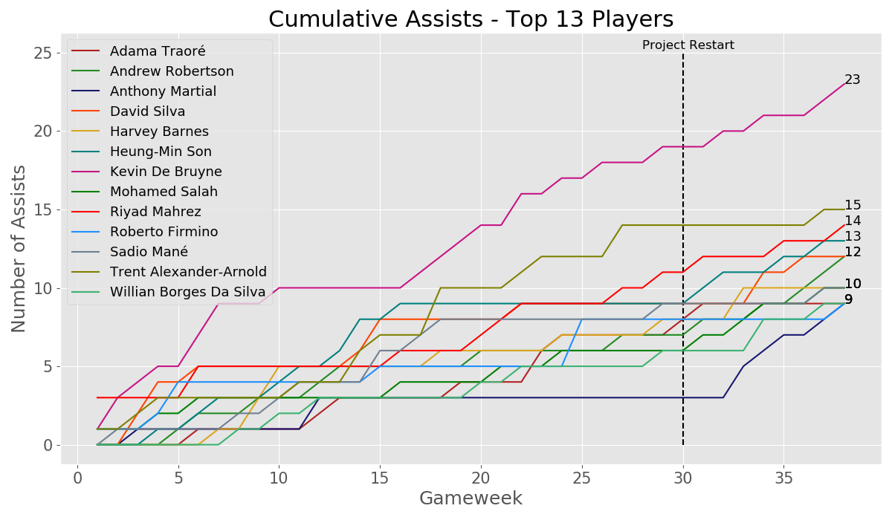
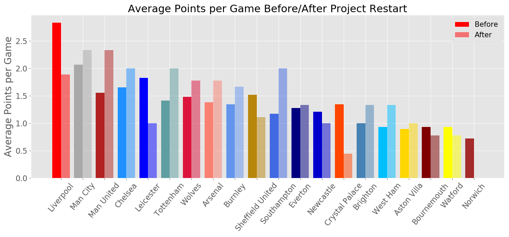

# 2019-2020 Premier League Season Analysis: How did COVID-19 impact the season and players?

## Table of Contents
* [Data](#data)
* [Teams](#teams)
* [Pre/Post-Restart Analysis](#Pre/Post-Restart-Analysis)
* [Future Work](#future-work)

# Motivation

As an avid fan of the Premier League, and football in general, I was really curious to use my skillset to analyze this season. I know there are lots of organizations out there that are picking apart and analyzing these data, but I wanted to have a look for myself. The Premier League season was put on pause due to the COVID-19 pandemic after Gameweek 29 had finished, on March 9th, 2020. Project Restart kicked off for Gameweek 30 on June 17th after a more than three month break to finish the season.

# Data

I used the combined gameweek dataset from [this](https://github.com/vaastav/Fantasy-Premier-League) GitHub that contained all stats for players in the 2019-2020 English Premier League season, as well as team data from [this](https://www.football-data.co.uk/englandm.php) site that provides a multitude of data, where I mainly just focused on results. This analysis simply takes a look at the trends of the seasons both with teams and with individual players.

## Teams

> Champions: **Liverpool** 99pts

> Runners-Up: **Manchester City** 81pts

> Also Qualified for Champions League: **Manchester United**, **Chelsea** 66pts

> Relegated to the Championship: **Bournemouth** 34pts, **Watford** 34pts, **Norwich City** 21pts

Here is a look at the points totals for the entire season, I also indicated where the Premier League restarted at Gameweek 30. 

And a look at the cumulative goals scored for the top six teams as well as the three relegated teams.

## Players 

### Top Scorers

Goals scored is commonly the first statistic to look at in terms of performance, so I had a look at the top 12 goal scorers and their production throughout the season and how they fared pre and post-restart. Jamie Vardy won the Golden Boot for most goals scored with 23 goals.

### Top Assists

## Pre/Post-Restart Analysis

I wanted to have a look at how teams were faring both before and after the restart. The plot above shows this. As you can see, Liverpool, the eventual Champions, had a pretty dramatic dip in performance after the restart, but this didn't stop them as they clinched the title shortly after the restart. Leicester, Crystal Palace and Norwich also had extreme declines in performance, leading to Norwich's relegation. Some notable improvements can be seen with Manchester United, jumping from ~1.5 points per game, to just beneath 2.5 points per game. Southampton had an even larger performance gain, increasing their average by over .8 points per game. However, the only statistically significant changes were for Liverpool, surprisingly, and Crystal Palace with an alpha set to .05. With more lenience in the alpha value, other teams showed some significant performance changes which can be seen above.

For a significance level of .05, both Liverpool and Crystal Palace's points per game average change was statistically significant with a p-value of: 0.022 and 0.013, respectively. And for a significance level of .1, Manchester United and Norwich's points per game average change was statistically significant with a p-value of: 0.062 and .082, respectively.

## Future Work

I plan to also perform similar tests to the amount of goals scored before and after the restart. Additionally, I want to take a look at individual players and their performances and see if there was any significant change there.

